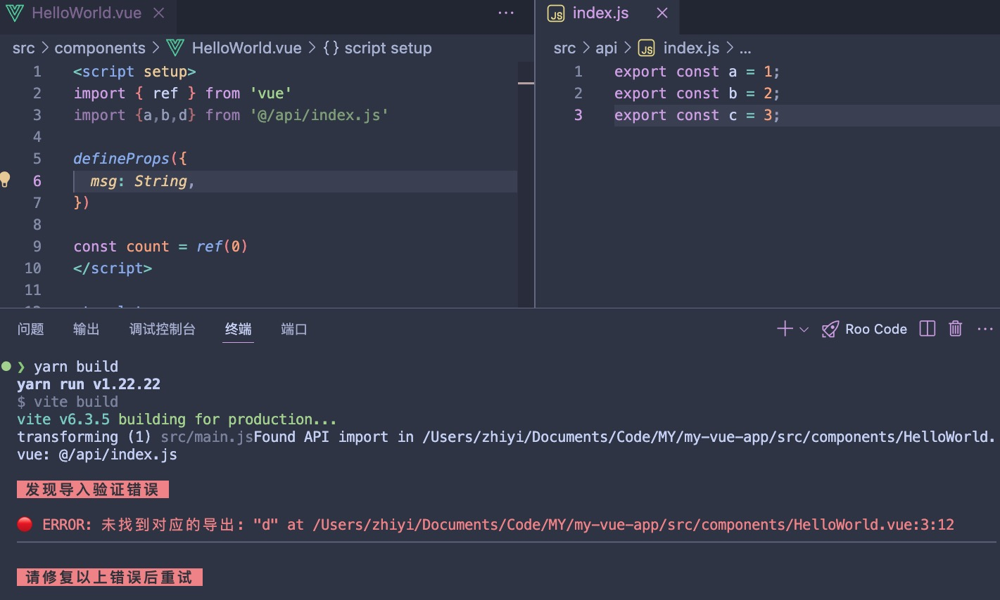

# import-validation-plugin

一个支持 vite 和 webpack 的导入验证插件

## 功能特性

- 在打包前验证定义的导入路径
- 抛出验证错误，强制停止打包
- 可配置的验证规则
- 支持 vite 以及 webpack



## 安装

```bash
# 使用npm
npm install import-validation-plugin

# 使用yarn
yarn add import-validation-plugin
```

## 使用方式

### vite
```javascript
import { importValidationForVite } from 'import-validation-plugin'

importValidationForVite({
    specify: ["api"], // 只检查导入 api 目录下文件的文件
    exclude: /node_modules/, // 忽略 node_modules
})
```

### webpack
```javascript
import { importValidationForWebpack } from 'import-validation-plugin'

new importValidationForWebpack({
    specify: ["api"], // 只检查导入 api 目录下文件的文件
    exclude: /node_modules/, // 忽略 node_modules
}),
```

## 配置选项

| 参数 | 类型 | 说明 | 默认值 |
| --- | --- |
| specify | string[] | 指定要检查的引入目录 | [] |
| exclude | RegExp | 要忽略的路径 | /node_modules/ |

